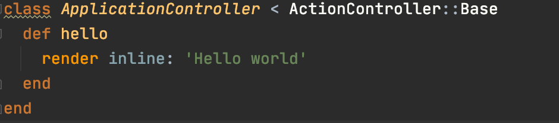

# Deploy Rails App to Gcloud
Deploy a sample Rails application to Gcloud using k8s and `kubernetes_helper` gem.

## Create a sample rails app
```bash
rails new sample_k8s
cd sample_k8s
```
- Add sample message
  - add `root 'application#hello'` to config/routes.rb
    
  - add the following to app/controllers/application.rb
    ```ruby
      def hello
        render inline: 'Hello world'
      end  
    ```
    
    
- Start server: `rails s -e prodution`
- Visit http://localhost:3000
  


## Prepare application for k8s
- Add Dockerfile to define app dependencies in a container
- Add .dockerignore to exclude unnecessary files like node_modules
- Test container: docker build .
- Create project on gcloud: https://console.cloud.google.com
- Enable kubernetes engine by navigating to: https://console.cloud.google.com/kubernetes/list
- Install k8s helper: `gem install kubernetes_helper -v '~>1.0'`

## Setup application in k8s (Following .kubernetes/readme.md instructions)
- Create project on gcloud   
  https://console.cloud.google.com

- Enable kubernetes engine by navigating to: https://console.cloud.google.com/kubernetes/list

- Login gcloud: `gcloud auth login`
- Connect project: `gcloud config set project my-project`    
- Create cluster: `gcloud container clusters create my-cluster --preemptible`
- Connect cluster: `gcloud container clusters get-credentials my-cluster --zone europe-west4-a`

- Edit `.kubernetes/settings.rb` (Step #6 from .kubernetes/readme.md)    
   Changed: app_name = is_production ? 'sample_k8s' : 'sample_k8s_beta'    
   Changed: command: 'rails s'     
   Make cloud_secret_name: nil # for now using default sqlite instead of gcloud sql (mysql or postgres)     
   Set gcloud settings in continuous_deployment{...}     

- Skip step #7 (using sqlite for testing purpose)

- Register app secrets (rails_env = "production" 64 base encoded)    
  Edit secrets.yml
  
  `DEPLOY_ENV=beta kubernetes_helper run_yml 'secrets.yml' 'kubectl create'`
  
- Create application pods: `DEPLOY_ENV=beta kubernetes_helper run_yml 'deployment.yml' 'kubectl create'`
  ```bash
  kubectl get pod
  ==> sample-k8s-beta-748f5546-9scb7              1/2     ImagePullBackOff   0          12s
  ```
  "ImagePullBackOff" is because app container is missing.

- Create service: `DEPLOY_ENV=beta kubernetes_helper run_yml 'service.yml' 'kubectl create'`

- Reserve a static ip address:     
  `DEPLOY_ENV=beta kubernetes_helper run_command "gcloud compute addresses create <%=ingress.ip_name%> --global"`
  ```bash
  gcloud compute addresses list
  ==> sample-k8s-beta-static-ip        35.227.200.216  EXTERNAL RESERVED
  ``` 

- Register ingress to receive http calls    
  `DEPLOY_ENV=beta kubernetes_helper run_yml 'ingress.yml' 'kubectl create'`
  ```bash
  kubectl get ingress
  ==> sample-k8s-beta-ingress        <none>   *   80      6s
  ```  
  
- Deploy application container
  ```bash
  DEPLOY_ENV=beta kubernetes_helper run_deployment 'cd.sh'
  ```
  
  
  ```bash
  kubectl get pod
  ==> sample-k8s-beta-ff6d794dc-nccm9             2/2     Running       0          26s
  ```
  
- Visit application by the generated ip (http://35.227.200.216)
  

## Extra steps
- Setup domain name (Step #12)
  - Visit your domain manager and point your domain or subdomain to the reserved ip: 35.227.200.216
  - Edit `.kubernetes/settings.rb` to set your domain name
  - Update ingress `DEPLOY_ENV=beta kubernetes_helper run_yml 'ingress.yml' 'kubectl apply'`
  - Visit your domain (depends on your provider can take more than 15 minutes to propagate ssl and domain name)

- Replace sqlite into Cloud sql
  - Create your database on cloud sql
  - Set your configurations in secrets.yml
  - Set your cloud sql info in `cloud_sql_instance` and `cloud_secret_name`
  - Download your cloudsql credentials from https://console.cloud.google.com/iam-admin/iam    
  - Register secrets on k8s: `DEPLOY_ENV=beta kubernetes_helper run_command "kubectl create secret generic <%=deployment.cloud_secret_name%> --from-file=credentials.json=<path-to-downloaded/credentials.json>"`
  - Apply secret changes: `DEPLOY_ENV=beta kubernetes_helper run_yml 'secrets.yml' 'kubectl apply'` 
  - Apply deployment changes: `DEPLOY_ENV=beta kubernetes_helper run_yml 'deployment.yml' 'kubectl apply'`
  
- Run sidekiq service
  - Edit settings.rb and set the correct values for `job_name, job_command, job_services`
  - Apply deployment changes: `DEPLOY_ENV=beta kubernetes_helper run_yml 'deployment.yml' 'kubectl apply'`
  - List pods:     
  ```bash
  kubectl get pod
  ==>
  sample-k8s-beta-748f5546-tj59k              2/2     Running       0          5s
  sample-k8s-beta-job-78c9c64f6-pd6cf         1/2     Running         0          4s
  ```